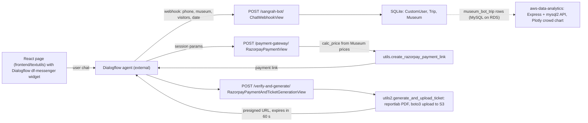

This README provides an overview of the project, including team details, relevant links, tasks completed, tech stack, key features, and steps to run the project locally.


## About Project
1. Easily accessible through phone and desktop and user gets payment done, ticket generation and personalised recommendations- all at a single place.
2. 24*7 multilingual NLP based chatbot support.
3. Recording every person museum selection response and storing it in database to predict which time has most crowd and alert the upcoming travellers.
4. Using Machine Learning to neglect spelling errors and GenAI to block hate contents.
5. Using gemini 1.5 flash to give a welcoming description of the chosen museum and make the conversation interesting.
6. Data collected using web scraping from official government sites.
7. Keeping the ticket pdf link active for only 1 min to prevent reuse and ensure data security.


## Team Details

**Team Name:** ERROR 404 : CHANGE FOUND

**Project Title** -Online Chatbot based ticketing system

**Team Leader:** [@HARSHDIPSAHA](https://github.com/HARSHDIPSAHA)

**Team Members:**

- **ANSHUMAN RAJ** - 2023UCD3053 - [@SAVAGECAT05](https://github.com/SAVAGECAT05)
- **HEMANK KAUSHIK** - 2023UEI2867 - [@HEMANKKAUSHIK](https://github.com/HEMANKKAUSHIK)
- **KANISHK SHARMA** - 2023UCD2175 - [@GHOSTDOG007](https://github.com/GHOSTDOG007)
- **ANSHIKA SINGH** - 2023UCA1946 - [@CUBIX33](https://github.com/CUBIX33)
- **HARSHDIP SAHA** - 2023UCA1897 - [@HARSHDIPSAHA](https://github.com/HARSHDIPSAHA)
- **AMAN BIHARI** - 2023UCA1910 - [@CODEBREAKER32](https://github.com/CODEBREAKER32)

**Live Deployment:** [View Deployment](https://willowy-toffee-89c6b8.netlify.app/)
  (deployment has been removed due to insufficient aws and google cloud credits)

  
**Run locally**
## Local Setup Instructions (Write for both windows and macos)

Follow these steps to run the project locally

1. **Clone the Repository**
   ```bash
   git clone https://github.com/HARSHDIPSAHA/Online-Museum-Ticketing-Chatbot
   cd REPO_DIRECTORY
   ```

# Django Backend 

This project is a Django-based backend for the museum ticketing chatbot: it receives Dialogflow webhook calls, stores users and trips, creates Razorpay payment links and generates ticket PDFs.
### 1. Clone the repository
 ```bash
git clone https://github.com/HARSHDIPSAHA/Online-Museum-Ticketing-Chatbot
```
### 2. Create and activate a virtual environment
 ```bash
python3 -m venv venv
source venv/bin/activate
``` 
For Windows, use `venv\Scripts\activate`

### 3. Install the dependencies
 ```bash
pip install -r requirements.txt
```
### 4. Setup the Django project (migrate database and create superuser)
 ```bash
python manage.py migrate
```
### 5. Start the development server
 ```bash

python manage.py createsuperuser
```
### 6. Run the server
 ```bash
python manage.py runserver
```
# REACT FRONTEND 
## Prerequisites
- Node.js (v14.x or later)
- npm (v6.x or later) or yarn.

## Setup instructions 

### 1. Clone the repository 
```bash
git clone <https://github.com/HARSHDIPSAHA/Online-Museum-Ticketing-Chatbot>

```
### 2. Install the dependencies 
 ```bash
npm install
npm install react-scripts 
npm install react-router-dom
```
### 3. Start the development server
```bash
npm start
```
### 4. Build for production (optional)
 ```bash
npm run build
```
### 5. For Backend Integration 
```bash 
npm install axios
```

## How it works



The Django URLs are in `SIH-main-backend/museum_booking/museum_bot/urls.py`: `sangrah-bot/`, `payment-gateway/`, `verify-and-generate/`.

## Project structure

```
SIH-main-backend/museum_booking/
  museum_booking/           Django settings and root urls
  museum_bot/               models (CustomUser, Trip, Museum), views (webhook, payment, ticket), utils.py (Razorpay), utils2.py (reportlab + S3)
  museum_bot/museum_static/ standalone ticket-PDF and S3 upload scripts
  requirements.txt          Django 5.1.1, DRF, razorpay, reportlab, boto3, mysqlclient
frontend/textutils/         create-react-app site (NCSM-styled landing page) embedding the Dialogflow messenger
aws-data-analytics/         Node scripts: data_retrieve.js (RDS query), analysis.js (Express /data endpoint), index.html (Plotly chart)
```

## Status and limitations

- Hackathon (SIH) prototype. The conversation logic (NLP, spelling tolerance, multilingual replies) lives in the Dialogflow agent, which is configured outside this repo; only the webhook fulfilment is here.
- Razorpay, AWS S3 and RDS credentials in the code are left blank and must be supplied; the live deployment has been taken down (see above).
- The Gemini museum-description step described in About Project is not part of the committed backend code.
- The frontend does not call the Django API directly; all interaction goes through the Dialogflow widget.
- `db.sqlite3` is committed; there are no tests beyond the Django and CRA defaults.

